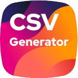

<p align="center">
  
</p>

RichID CSV Generator Bundle
=======================================

This version of the bundle requires Symfony 4.4+ and PHP 7.3+.

[](https://packagist.org/packages/rich-id/csv-generator-bundle)
[](https://github.com/t/rich-id/csv-generator-bundle/actions)
[](https://coveralls.io/github/rich-id/csv-generator-bundle?branch=master)
[](https://codeclimate.com/github/rich-id/csv-generator-bundle/maintainability)
[](https://github.com/rich-id/csv-generator-bundle/issues)
[](LICENSE.md)

The bundle provides a set of annotations and configurations to quickly and easily generate CSV from a model instance.

# Table of content

1. [Installation](#1-installation)
2. [Getting started](#2-getting-started)
3. [Usage](#3-usage)
4. [Versioning](#4-versioning)
5. [Contributing](#5-contributing)
6. [Hacking](#6-hacking)
7. [License](#7-license)


# 1. Installation

This version of the bundle requires Symfony 4.4+ and PHP 7.3+.

```bash
composer rich-id/csv-generator-bundle
```

# 2 Getting started

Create a model that reflects what you want to serialize. Keep in mind that the order of the properties are will be preserved in the generated CSV file.

```php
use RichId\CsvGeneratorBundle\Annotation as CSV;

class DummyCsvModel
{
    /** @var string */
    public $firstEntry;
    
    /**
     * @var string
     *            
     * @CSV\Translate(prefix="dummy_model.second_entry.")
     */
    public $secondEntry;
    
    /**
     * @var int
     */
    private $thirdEntry;
    
    public function getThirdEntry(): int
    {
        return $this->thirdEntry;
    }
}
```

- Note that the second entry will be translated using the [Symfony Translator](https://symfony.com/doc/current/translation.html).
- Note that the third entry is private, and the [Symfony PropertyAccessor](https://symfony.com/doc/current/components/property_access.html) will be used to fetch its value.

This will be easily serialized using the Symfony Serializer. 

```php
use Symfony\Bundle\FrameworkBundle\Controller\AbstractController;
use Symfony\Component\Serializer\SerializerInterface;
use Symfony\Component\HttpFoundation\Response;

class DummyController extends AbstractController
{
    public function dummyRouteAction(SerializerInterface $serializer): Response
    {
        // ...
        $serialized = $serializer->serialize($dummyCsvModel, 'csv');
        
        return new Response($serialized);
    }
}
```

# 3. Usage

- [Translation](Docs/Translation.md)
- [Streamed response](Docs/StreamedResponse.md)

# 4. Versioning

template-bundle follows [semantic versioning](https://semver.org/). In short the scheme is MAJOR.MINOR.PATCH where
1. MAJOR is bumped when there is a breaking change,
2. MINOR is bumped when a new feature is added in a backward-compatible way,
3. PATCH is bumped when a bug is fixed in a backward-compatible way.

Versions bellow 1.0.0 are considered experimental and breaking changes may occur at any time.


# 5. Contributing

Contributions are welcomed! There are many ways to contribute, and we appreciate all of them. Here are some of the major ones:

* [Bug Reports](https://github.com/rich-id/csv-generator-bundle/issues): While we strive for quality software, bugs can happen and we can't fix issues we're not aware of. So please report even if you're not sure about it or just want to ask a question. If anything the issue might indicate that the documentation can still be improved!
* [Feature Request](https://github.com/rich-id/csv-generator-bundle/issues): You have a use case not covered by the current api? Want to suggest a change or add something? We'd be glad to read about it and start a discussion to try to find the best possible solution.
* [Pull Request](https://github.com/rich-id/csv-generator-bundle/merge_requests): Want to contribute code or documentation? We'd love that! If you need help to get started, GitHub as [documentation](https://help.github.com/articles/about-pull-requests/) on pull requests. We use the ["fork and pull model"](https://help.github.com/articles/about-collaborative-development-models/) were contributors push changes to their personnal fork and then create pull requests to the main repository. Please make your pull requests against the `master` branch.

As a reminder, all contributors are expected to follow our [Code of Conduct](CODE_OF_CONDUCT.md).


# 6. Hacking

You might use Docker and `docker-compose` to hack the project. Check out the following commands.

```bash
# Start the project
docker-compose up -d

# Install dependencies
docker-compose exec application composer install

# Run tests
docker-compose exec application bin/phpunit

# Run a bash within the container
docker-compose exec application bash
```


# 7. License

template-bundle is distributed under the terms of the MIT license.

See [LICENSE](LICENSE.md) for details.
